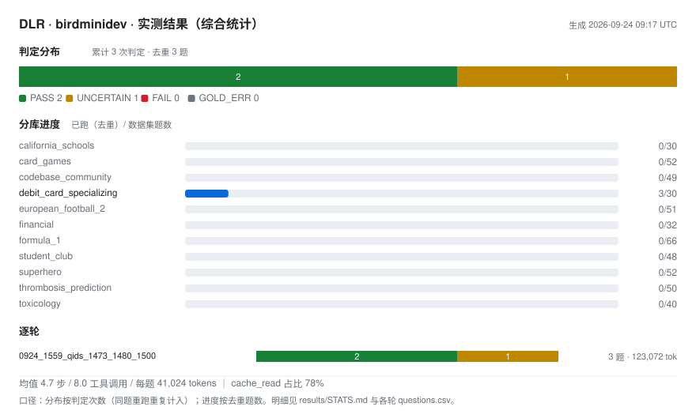

# 场景 1 · NL2SQL（数据集 `birdminidev`）—— TSM + DLR 怎么用

> **定位**：把 TSM（三级语义建模）+ DLR 用到真实 NL2SQL 数据集上的**第一个场景**。
> **规范与原则**（LE / PE / 库表如何抽象成两层 / 建模规则与自检）在 **[docs/03-design.md](../../docs/03-design.md)**；
> 本文按用法顺序展开：**数据集介绍（含数据集缺陷）→ 建模应用思路 → 应用结果 → 处理和使用流程 → 实测结果**。
> 场景包规范（目录约定、换场景 checklist）：[docs/04-application.md](../../docs/04-application.md)。

## 一、数据集介绍（含数据集缺陷）

### 原生语义：原来在哪

| 原料 | 位置 | 内容 |
|---|---|---|
| **列级说明** | `MINIDEV_sqlite/dev_databases/<db>/database_description/*.csv` | `original_column_name, column_name, column_description, data_format, value_description`（BIRD 原生；**部分列的描述为空**） |
| **表/列/外键** | `MINIDEV_sqlite/dev_tables.json` | 表名、列名、外键——**外键不全**（如 debit_card 只登记了 1 条） |
| **物理真相** | `<db>.sqlite` 本体 | `PRAGMA table_info / foreign_key_list`——**类型与 FK 以此为准** |
| **题目与 evidence** | `MINIDEV_sqlite/mini_dev_sqlite.json` | `{question_id, db_id, question, evidence, SQL, difficulty}`；**evidence 是出题人给的提示**——L2/L3 主要由此派生 |

### 数据集缺陷记录（跑题暴露的问题 ↔ SOP 裁定）

> 数据集自身的问题（gold 缺陷 / 样本窗口 / 描述失真）由跑题暴露出来，每题一节 L3 `sop.md` 裁定承载——
> **数据集的错**在这里，**我们为什么这么答**也在这里（逐题来龙去脉见并列的 [DETAIL.md](DETAIL.md)）。

<!-- mistakes:begin -->
| 题号 | 库 | 评定 | 类型 | 问题（截） | 裁定（全文见 [DETAIL.md](DETAIL.md)） |
|---|---|---|---|---|---|
| q1481 | debit_card_specializing | 🔁 翻盘 | 数据集问题 · 难题 | What is the difference in the annual average consumption | Per customer, total up their 2013 CZK consumption. Then, **per segment**, take the customer(s) with the lowest 2013 total. "Annual |
| q1482 | debit_card_specializing | 🔁 翻盘 | 数据集问题 | Which of the three segments—SME, LAM and KAM—has the big | The question names the currency, so the consumption must be filtered to customers whose billing currency is EUR (`Currency = 'EUR' |
| q1490 | debit_card_specializing | 🔁 翻盘 | 数据集问题 · 难题 | How many percent of LAM customer consumed more than 46.7 | "Percent of customers" is counted **per customer**, not per customer-month record. One customer = one unit in both the numerator a |
| q1493 | debit_card_specializing | ❌ 错误 | 难题 | In February 2012, what percentage of customers consumed | "Percentage of customers" is counted per customer -- one customer = one unit in both the numerator and the denominator -- and **th |
| q1500 | debit_card_specializing | 🔁 翻盘 | 数据集问题 | Please list the product description of the products cons | The individual-purchase records are only a **four-day sample**: they cover 2012-08-23 through 2012-08-26, and nothing else. Any mo |
| q1501 | debit_card_specializing | 🔁 翻盘 | 数据集问题 | Please list the countries of the gas stations with trans | Same sample-window fact: the individual-purchase records cover only 2012-08-23~26, so no purchases took place in June 2013, and th |
| q1525 | debit_card_specializing | 🔁 翻盘 | 数据集问题 | What is the percentage of the customers who used EUR in | "Percentage of customers" = **customers**, not transactions: one customer counts once, in both the numerator and the denominator, |
| q1526 | debit_card_specializing | 🔁 翻盘 | 数据集问题 · 难题 | For the customer who paid 634.8 in 2012/8/25, what was t | "paid 634.8" identifies the customer through a single purchase of that amount on that date -- a purchase-level condition, not a mo |
| q1529 | debit_card_specializing | 🔁 翻盘 | 数据集问题 | What is the amount spent by customer "38508" at the gas | "Amount spent by a customer" is that customer's total consumption across all gas stations -- a question about the customer's month |
| q1531 | debit_card_specializing | 🔁 翻盘 | 数据集问题 · 难题 | Who is the top spending customer and how much is the ave | "Top spending customer" is decided by the customer's total consumption across all gas stations (the month-by-month figures), not b |
<!-- mistakes:end -->

## 二、建模应用思路（原料 → 三层）

```
database_description/*.csv（列说明）─┐
dev_tables.json（表/列/关系）────────┼─▶ L1 `dlr`（逐库表列全覆盖；每条描述可追源）
SQLite PRAGMA（真实类型/FK）────────┘        ↑ 行使 correction 权：CSV 空白由 L1 补；历史失真由 L1 注明
evidence 中属于「源自身」的部分 ─────────────┘（值域 / 粒度 / 样本窗口 / 枚举 / 编码）
evidence 的剩余 ──────────────────────────▶ L2 `consensus`（题面口径 / 术语映射 / 背景；非 workflow）
建模 bug · 数据集 bug · 召回冲突 · 难题拆解 ─▶ L3 `sop`（题级打法与陷阱）
```

**对账即自证**：`tsm coverage`（开发态）把这三步变成三张对账单——L1 列级/关系级（硬）、L2 残差（启发式）。

**建模原则**：L1 一列一描述、全部取自**数据集原生**（不做语义丰富度补充，保证公平）；数据集的问题与麻烦**不在 L1 修**，交 L3 `sop.md` 承载并打标——口径见 [docs/04-application.md](../../docs/04-application.md) §二。

## 三、应用结果（本场景的模型）

| 库 | LE | PE（表 → LE） | PAS | 表/列 | 抽象决策（要点） |
|---|---|---|---|---|---|
| california_schools | 2 | School ← schools ｜ SchoolPerformance ← satscores+frpm | 1 | 3/89 | 两个成绩视角（sat / frpm）归一个 LE |
| card_games | 4 | Card ← cards ｜ CardExtension ← legalities+rulings+foreign_data ｜ CardSet ← sets ｜ SetTranslation ← set_translations | 3 | 6/115 | 同卡的多视角（法律性/裁定/外文印）收敛为一个 LE |
| codebase_community | 6 | User ← users ｜ Post ← posts ｜ PostInteraction ← comments+postHistory+postLinks ｜ Tag ← tags ｜ Badge ← badges ｜ Vote ← votes | 4 | 8/71 | 三种"帖子交互"归一个 LE；Tag/Badge/Vote 各自独立 |
| debit_card_specializing | 4 | Customer ← customers ｜ Consumption ← yearmonth+transactions_1k ｜ GasStation ← gasstations ｜ Product ← products | 3 | 5/21 | 月度汇总与逐笔样本**两种粒度**同属 Consumption，差异由各自 PE 说明 |
| european_football_2 | 4 | Player ← Player+Player_Attributes ｜ Team ← Team+Team_Attributes ｜ Match ← Match ｜ League ← League | 2 | 7/199 | 「主表 + 属性面」成对归一个 LE |
| financial | 6 | Account ← account+disp+card ｜ Client ← client ｜ District ← district ｜ Loan ← loan ｜ Transaction ← trans ｜ PermanentOrder ← order | 6 | 8/55 | 纯 junction（disp）与卡**下沉为 PE**；有独立生命周期的 Loan/Transaction/Order 升独立 LE |
| formula_1 | 8 | Driver ← drivers ｜ Circuit ← circuits ｜ Race ← races ｜ DriverRaceData ← qualifying+results+lapTimes ｜ DriverStandings ← driverStandings ｜ PitStop ← pitStops ｜ Constructor ← constructors ｜ ConstructorRaceData ← constructorResults+constructorStandings | 4 | 13/94 | 一场比赛的多视角（排位/结果/圈速）归一个 LE |
| student_club | 8 | Member ← member ｜ Event ← event ｜ Attendance ← attendance ｜ Budget ← budget ｜ Expense ← expense ｜ Income ← income ｜ Major ← major ｜ ZipCode ← zip_code | 7 | 8/48 | member↔event 的桥（attendance）独立成 LE；Major/ZipCode 作维度 |
| superhero | 3 | Superhero ← superhero+colour+race+gender+publisher+alignment ｜ Power ← hero_power+superpower ｜ Attribute ← hero_attribute+attribute | 2 | 10/31 | 5 张碎片维度表收敛进主 LE（"碎表集中"样板）；Power/Attribute 独立 LE + PAS |
| thrombosis_prediction | 1 | Patient ← Patient+Laboratory+Examination | 0 | 3/64 | 3 表共享 `PatientID` 锚键 → **1 LE + 3 PE + 0 PAS**（ARCS 隐式编码 JOIN） |
| toxicology | 3 | Molecule ← molecule ｜ Atom ← atom ｜ Bond ← bond+connected | 3 | 4/11 | bond+connected 合成一个 LE；Atom/Molecule 各自 |
| **合计** | **49** | **72 PE** | **35** | 1133 节点 | |

## 四、处理和使用流程（这份数据集怎么跑）

```
① 建模（一次性）    原料 → L1；evidence 残差 → L2          tsm build
② 跑题（持续）      单题：dsh headless → 答案 → 与 gold 比对  run_one.sh / 批跑器
②′ SOP 边跑边更新   每遇「数据集问题 / 建模冲突 / 难题 / 其他」→ sop.md 补节并打标
③ 复跑              同一批题再跑，验证 SOP 命中后的行为变化
④ 全量             **500 题跑一轮 → 结果表（对 / 错 / 存疑）**
⑤ 回归             L1/L2 不退化：tsm verify + tsm coverage
```

**要点**：

- **SOP 不是预先写全的**——它是"运行暴露问题 → 归类 → 补节 → 打标"的**累积产物**（事后准入）；每节只在该题命中时生效。
- **判定**：执行 gold SQL 得期望值 ↔ agent 答案（规则判定；数值容差 + 字符串归一；存疑进人工/仲裁清单）。
- **规模**：500 题 × 单题约 1.5 分钟；并发 N 路时 ≈ 500×1.5/N 分钟（N=6 ≈ 2 小时）。

**开发态命令**：

```bash
cd "TSM Core Service"
tsm build            # 向量（LanceDB）+ 图（Neo4j 兼容样例）
tsm verify           # 回归套件（对 fixtures 自证；fixtures = 回归快照）
tsm viz --open       # 看结构（LE/PE/ARCS/PAS 图谱页）
tsm coverage         # 覆盖度对账（本场景离"最优解"的差距）
```
跑题与排障见 [docs/run.md](../../docs/run.md)；换场景见 [docs/04-application.md](../../docs/04-application.md)；评测（考卷 + 考试系统）见 [docs/eval.md](../../docs/eval.md)。

## 五、实测结果

> 跑批结果按轮次留档在 [`results/`](results/)：raw 可追溯日志 + 判定明细 + 单轮汇总；综合统计由 `tsm stats` 汇总生成，并同步一份到本节。

<!-- stats:begin -->


**评定**（按 SOP 裁定 · 500 题口径）：✅ 正确 20 ｜ 🔁 翻盘 9 ｜ ❌ 错误 1 ｜ ⚠️ 待仲裁 0 ｜ ⬜ 未跑 470　—　**已跑 30 题：正确 29 题**

（🔁 翻盘 = 数据集自身缺陷（gold 未实现题面）按 SOP 逐题裁定为正确——单独计数、不并入 ✅ 正确；每题取最新一轮）

均值 **5.4 步 / 8.3 工具调用 / 每题 57,700 tokens** ｜ 跑题覆盖度 **30/500 题**（1/11 库有产物）

> 本块由 `tsm stats` 自动同步。**逐题明细**（评定 / 调用步骤 / 依据与结论）见并列的 [DETAIL.md](DETAIL.md)；逐轮统计 [results/STATS.md](results/STATS.md)。与 gold 的**原始逐字比对**（含 9 道数据集缺陷题的比对记录）也在这两处可查。
<!-- stats:end -->

**怎么看**：判定口径见 [results/README.md](results/README.md)；**逐题明细**（判定 / 调用步骤 / 依据与结论）见并列的 [DETAIL.md](DETAIL.md)，机器可读 `results/<轮次>/questions.csv`（含 `session` 列，可解码回放）；逐轮统计 `results/STATS.md`。

**怎么更新**：跑完一批 → `tsm grade --run <轮次目录>` → `tsm stats`（重算图与本节块）；跑题中遇到的问题按类型补进 `sources/sop.md`。

## 六、目录速查

```
scenarios/birdminidev/
├── README.md            # ← 本文（数据集（含缺陷）→ 建模思路 → 结果 → 流程 → 实测）
├── DETAIL.md            # 评测明细（逐题校验表 / 跑题覆盖度 / 汇总 / 数据集缺陷与裁定 / 逐题明细：怎么对的）
├── results/             # 跑批留档（按轮次：raw 日志 + 判定 CSV + 单轮汇总；stats.svg 综合统计图）
├── sources/
│   ├── configs/{ER,DLR,RDF}/   # L1 建模源（本线消费 DLR；ER/RDF 为评测线遗留）
│   ├── consensus/*.jsonl       # L2 源（11 库；两种格式：聚合式 / 逐题式）
│   └── sop.md                  # L3 源（题级打法；sync_sop.sh 的输入）
└── fixtures/                   # 回归快照（verify 套件对照）
```
